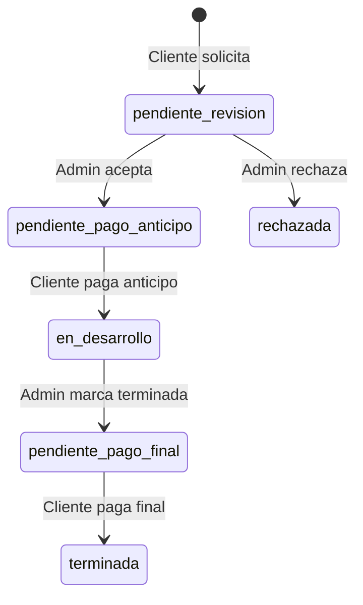
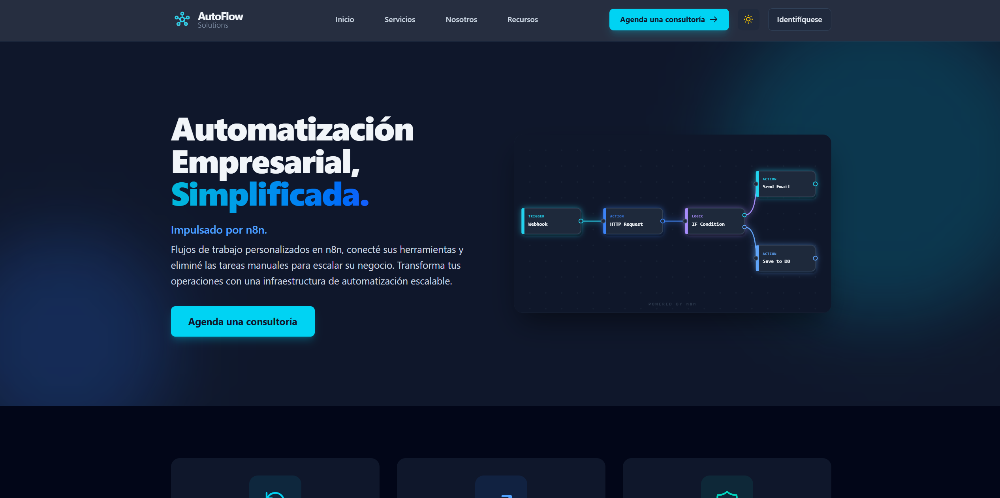
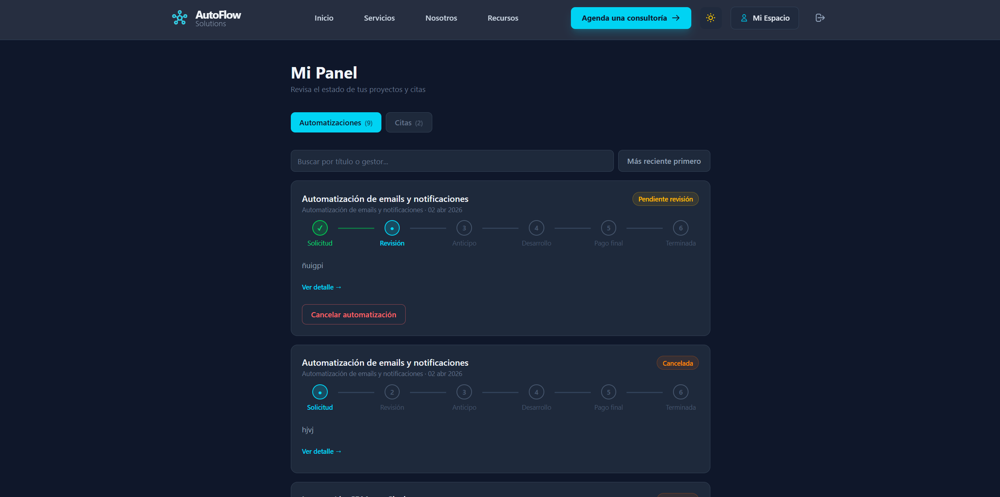
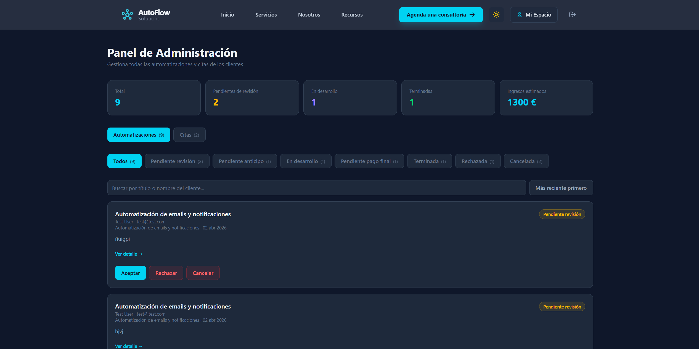

# ⚡ AutoFlow Solutions (TFG)

[](LICENSE)
[](https://www.python.org/)
[](https://reactjs.org/)
[](https://www.mongodb.com/)
[](https://www.docker.com/)

Plataforma web para la gestión integral de proyectos de automatización empresarial. Desarrollada como **Trabajo de Fin de Grado (DAW)**, simula el flujo real de una consultora de automatización: desde la solicitud de consultoría inicial hasta el pago fraccionado con Stripe y la valoración final del servicio.

---

## 📖 Documentación del Proyecto

- 📘 [**Memoria Técnica Completa (TFG_REPORT.md)**](./docs/TFG_REPORT.md) — *Documento principal con toda la información requerida.*
- 🏛️ [Arquitectura del Sistema](./docs/ARCHITECTURE.md)
- 🗄️ [Esquema de Base de Datos](./docs/DATABASE_SCHEMA.md)
- 📝 [Funcionalidades Implementadas](./docs/FEATURES.md)

---

## 🎯 Resumen y Propósito

**AutoFlow Solutions** permite a empresas contratar servicios de automatización de procesos de negocio de forma completamente digital. Un cliente puede registrarse, solicitar una cita de consultoría y, tras la valoración del equipo, gestionar su proyecto a través de todas las fases: revisión, pago de anticipo, seguimiento del desarrollo, pago final y valoración.

El sistema incluye un panel de administración completo para gestionar clientes, proyectos y publicar avances, todo con autenticación JWT, integración con Stripe y soporte para modo oscuro/claro.

---

## 🛠️ Tecnologías Utilizadas

| Capa | Tecnología |
|---|---|
| **Frontend** | React 19 + TypeScript + Vite + TailwindCSS v4 |
| **Backend** | Flask (Python 3.9) + PyJWT + Stripe |
| **Base de datos** | MongoDB 7 |
| **Infraestructura** | Docker + Docker Compose |

---

## 👥 Roles y Casos de Uso

El sistema define dos tipos de usuario:

1. **Cliente:**
   - Registrarse y solicitar citas de consultoría.
   - Seguir el ciclo de vida de sus automatizaciones.
   - Pagar anticipo y pago final mediante Stripe Checkout.
   - Valorar el servicio recibido.
   - Chatear con el equipo en cada proyecto.

2. **Administrador:**
   - Gestión global de citas y automatizaciones.
   - Aceptar/rechazar solicitudes y asignar presupuesto.
   - Publicar hitos de desarrollo con porcentaje de avance.
   - Marcar proyectos como terminados.

---

## 🔄 Ciclo de Vida de una Automatización



---

## 📦 Instalación y Configuración

### Requisitos Previos
- [Docker Desktop](https://www.docker.com/products/docker-desktop/) instalado y en ejecución
- Git

### 1. Clonar el repositorio

```bash
git clone <url-del-repositorio>
cd TFG-MARIOVALIENTE
```

### 2. Configurar variables de entorno

**Backend** — crear `backend/.env`:

```env
MONGO_URI=mongodb://mongo_db:27017/n8n_consultoria_db
SECRET_KEY=una_clave_secreta_segura_aqui
PORT=5000
DEBUG=True
STRIPE_SECRET_KEY=tu_clave_aqui
STRIPE_WEBHOOK_SECRET=tu_webhook_secret
FRONTEND_URL=http://localhost:5173
```

**Frontend** — crear `frontend/.env`:

```env
VITE_API_URL=http://localhost:5000/api
```

### 3. Levantar los contenedores

```bash
docker-compose up --build
```

### 4. Crear usuario administrador

Con los contenedores corriendo, acceder al shell de MongoDB y actualizar el rol:

```bash
docker exec -it autoflow_mongo mongosh
```

```javascript
use n8n_consultoria_db
db.Usuarios.updateOne(
  { correo_electronico_acceso: "tu@email.com" },
  { $set: { rol: "admin" } }
)
```

### 5. Acceder a la aplicación

| URL | Descripción |
|---|---|
| `http://localhost:5173` | Aplicación frontend |
| `http://localhost:5000/api` | API backend |
| `mongodb://localhost:27018` | MongoDB (Compass, etc.) |

---

## 💳 Stripe — Datos de prueba

```
Tarjeta:    4242 4242 4242 4242
Expiración: Cualquier fecha futura (ej. 12/28)
CVC:        Cualquier número de 3 dígitos (ej. 123)
CP:         Cualquier código postal (ej. 12345)
```

> Para recibir webhooks en local usa [Stripe CLI](https://stripe.com/docs/stripe-cli):
> ```bash
> stripe listen --forward-to localhost:5000/api/stripe/webhook
> ```

---

## 📁 Estructura del Proyecto

```text
TFG-MARIOVALIENTE/
├── backend/
│   ├── app.py                    # Entrada principal Flask
│   ├── db.py                     # Conexión a MongoDB
│   ├── blueprints/               # Rutas por dominio (auth, citas, automatizaciones, stripe)
│   └── middleware/               # Decoradores JWT (require_auth, require_admin)
├── frontend/
│   └── src/
│       ├── pages/                # Páginas por ruta
│       ├── components/           # Componentes reutilizables
│       ├── context/              # AuthContext, ThemeContext
│       ├── services/             # Llamadas a la API
│       └── types/                # Interfaces TypeScript
├── docs/                         # Documentación técnica del TFG
├── docker-compose.yml
└── LICENSE
```

---

## 🚀 Despliegue (Estado Actual)

> [!IMPORTANT]
> **Pendiente de despliegue:** El proyecto se ejecuta localmente mediante Docker.
>
> **Plan de despliegue:**
> - **Frontend:** Vercel / Netlify
> - **Backend:** Render / Railway
> - **Base de datos:** MongoDB Atlas

---

## 📸 Capturas de Pantalla

<table>
  <tr>
    <td><br/><sub>Página principal</sub></td>
    <td><br/><sub>Dashboard de cliente</sub></td>
  </tr>
  <tr>
    <td><br/><sub>Dashboard de administrador</sub></td>
    <td></td>
  </tr>
</table>

---

## 🧑‍🏫 Información Académica

| Campo | Valor |
|---|---|
| **Autor** | Mario Valiente Giraldo |
| **Centro** | IES Hermenegildo Lanz |
| **Ciclo** | Desarrollo de Aplicaciones Web (DAW) |
| **Curso** | 2025 / 2026 |

---

## 📜 Licencia

Este proyecto está bajo la protección de **Todos los derechos reservados**. Consulta el archivo [LICENSE](LICENSE) para más detalles.
