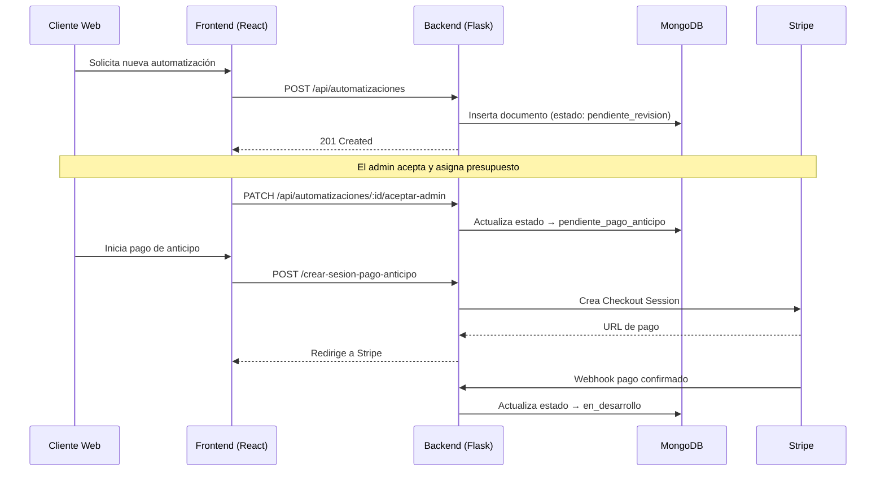
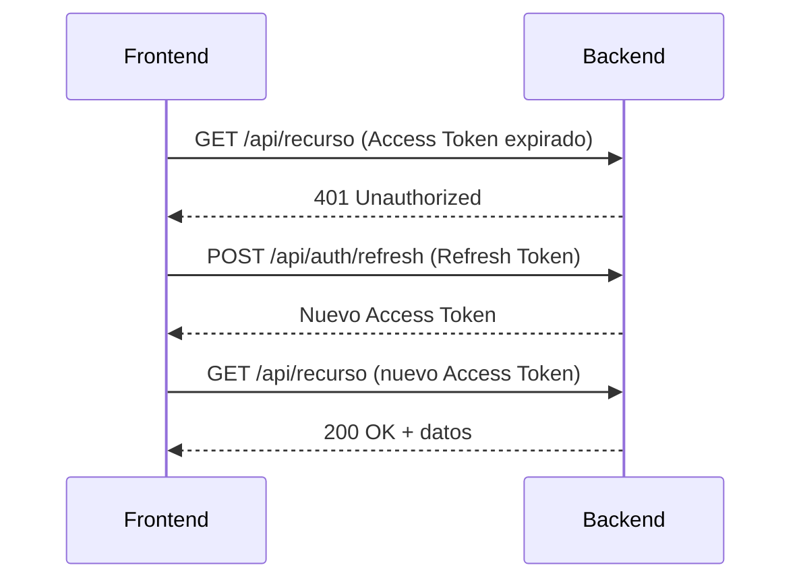

# 🏛️ Arquitectura del Sistema — AutoFlow Solutions

Este documento describe la arquitectura técnica y los patrones de diseño utilizados en el proyecto.

---

## 🏗️ Resumen de la Estructura

El sistema sigue un patrón **monorepo simplificado** con dos directorios principales: `/backend` y `/frontend`, orquestados mediante Docker Compose.

---

## 🗄️ Backend (Flask & Python)

El backend sigue una arquitectura en capas con **Blueprints de Flask** para separar responsabilidades:

1. **Blueprints:** Agrupan los endpoints por dominio (`auth`, `citas`, `automatizaciones`, `stripe_webhook`).
2. **Middleware:** Decoradores reutilizables para autenticación y autorización (`require_auth`, `require_admin`).
3. **db.py:** Capa de acceso a datos, gestiona la conexión con MongoDB a través de PyMongo.
4. **app.py:** Punto de entrada de la aplicación, registra todos los blueprints y configura CORS y JWT.

**Patrones Utilizados:**
- **Blueprint Pattern:** Modularización de rutas por dominio funcional.
- **Middleware Pattern:** Decoradores para validar JWT en rutas protegidas.
- **Repository-lite Pattern:** `db.py` centraliza la obtención de la instancia de MongoDB.

---

## 🎨 Frontend (React 19 & TypeScript)

El frontend utiliza un enfoque moderno basado en componentes funcionales y hooks:

1. **Pages:** Una página por ruta de la aplicación (`/login`, `/dashboard/cliente`, `/dashboard/admin`, etc.).
2. **Components:** Divididos por función (layout, formularios, chat, animaciones N8N).
3. **Context:** Estado global de autenticación (`AuthContext`) y tema visual (`ThemeContext`).
4. **Services:** Capa de comunicación con el backend, con renovación automática de JWT.
5. **Types:** Interfaces TypeScript compartidas entre páginas y servicios.
6. **\*Styles.ts:** Cada componente tiene su archivo de estilos como funciones `(theme) => string` con clases Tailwind.

---

## 🔄 Flujo de Datos Principal

### Ciclo de Vida de una Automatización

---

## 🔐 Autenticación JWT

El sistema implementa doble token con renovación silenciosa:

- **Access Token:** Duración 15 minutos. Se envía en cada petición autenticada.
- **Refresh Token:** Duración 7 días. Se usa para obtener un nuevo Access Token sin requerir login.
- El frontend intercepta peticiones, detecta tokens expirados y llama a `/api/auth/refresh` automáticamente antes de reintentar.

---

## 🔌 Integraciones Externas

- **Stripe Checkout:** Sesiones de pago seguras para anticipo (50%) y pago final (50%). El estado del proyecto se actualiza automáticamente vía webhook.
- **Stripe CLI (desarrollo):** Necesario para recibir webhooks localmente (`stripe listen --forward-to localhost:5000/api/stripe/webhook`).

---

## 🛡️ Seguridad

- **JWT:** Rutas protegidas con Bearer Token. Doble capa: `require_auth` y `require_admin`.
- **CORS:** Configurado para aceptar únicamente peticiones desde el dominio del frontend.
- **PyJWT:** Firma y verificación de tokens con clave secreta configurable por variable de entorno.
- **Stripe Webhooks:** Verificación de firma del webhook para garantizar que los eventos son legítimos.
- **Roles:** El rol `admin` no se puede asignar desde la interfaz; solo modificando MongoDB directamente.

---

## 🐳 Infraestructura Docker

El proyecto se orquesta con Docker Compose. Tres servicios:

| Servicio | Imagen base | Puerto host | Puerto interno |
|---|---|---|---|
| `frontend` | Node 22 Alpine + Nginx | `5173` | `80` |
| `backend` | Python 3.11 Slim | `5000` | `5000` |
| `mongo_db` | MongoDB 7 | `27018` | `27017` |

> MongoDB se expone en el puerto **27018** del host para evitar conflictos con instancias locales.
