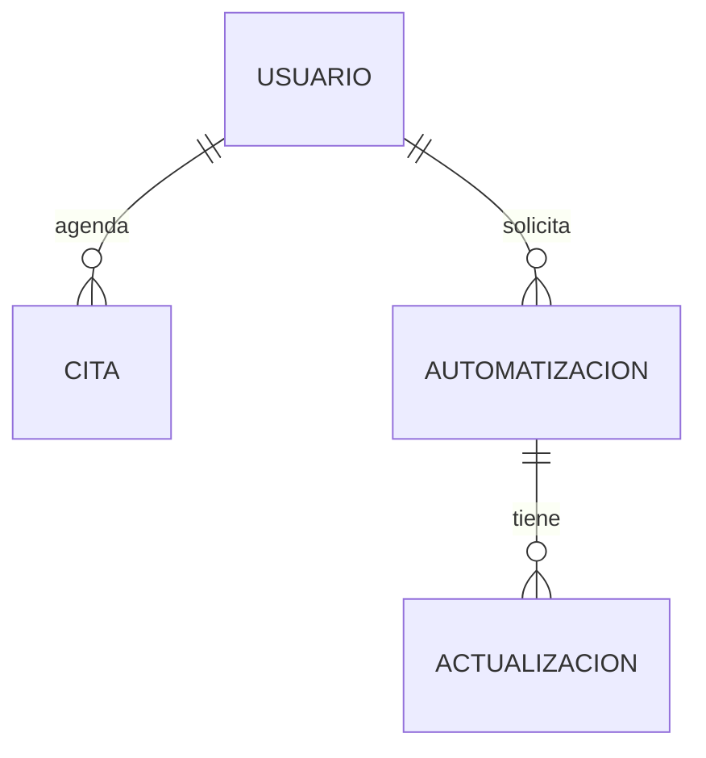
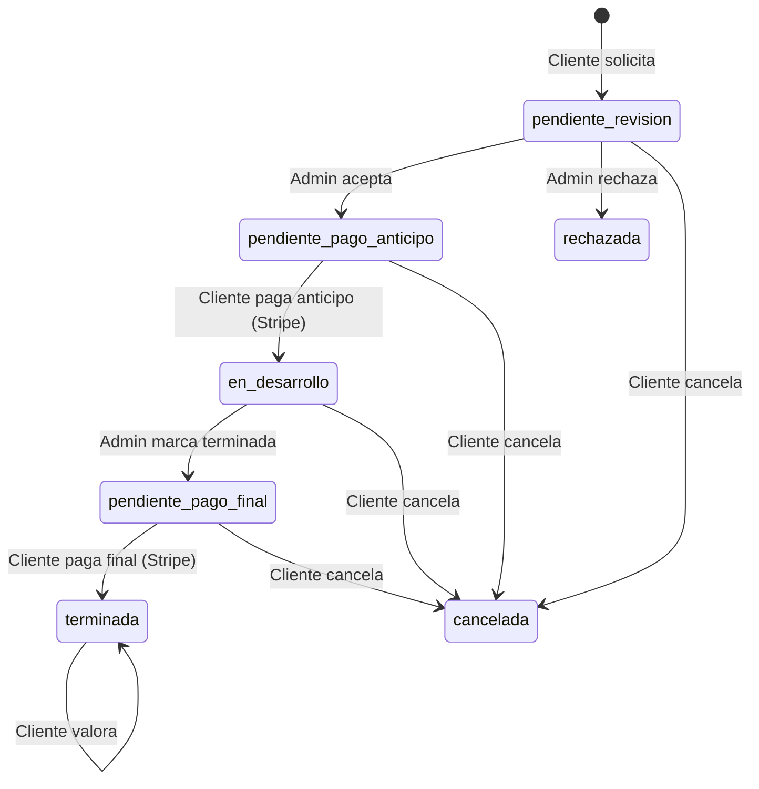

# 🗄️ Esquema de Base de Datos — AutoFlow Solutions

Este documento detalla el modelo de datos utilizado en AutoFlow Solutions. La persistencia se gestiona mediante **MongoDB** (base de datos documental), accedida desde el backend con **PyMongo**.

---

## 📊 Diagrama de Entidad-Relación (Conceptual)

---

## 📁 Base de Datos

**Nombre:** `n8n_consultoria_db`

---

## 📋 Colección: `Usuarios`

Almacena tanto clientes como administradores. El campo `rol` diferencia el tipo de acceso.

| Campo | Tipo | Descripción |
|---|---|---|
| `_id` | ObjectId | Identificador interno de MongoDB |
| `identificador_unico_usuario` | String (UUID) | Identificador público único del usuario |
| `correo_electronico_acceso` | String | Email de acceso (único) |
| `contrasena` | String | Hash Werkzeug (scrypt) |
| `telefono` | String | Teléfono de contacto |
| `datos_perfil_comercial.nombre` | String | Nombre completo |
| `datos_perfil_comercial.empresa` | String | Empresa del cliente |
| `rol` | String | `"cliente"`, `"admin"` o `"superadmin"` |
| `fecha_registro` | Date | Fecha de alta |
| `aceptacion_terminos` | Boolean | Aceptación de términos de uso |

---

## 📋 Colección: `Citas`

Registra las solicitudes de consultoría previas a una automatización.

| Campo | Tipo | Descripción |
|---|---|---|
| `_id` | ObjectId | Identificador interno |
| `identificador_unico_cita` | String (UUID) | Identificador público único de la cita |
| `nombre` | String | Nombre del solicitante |
| `email` | String | Email del solicitante |
| `telefono` | String | Teléfono de contacto |
| `empresa` | String | Empresa del solicitante |
| `tipo_automatizacion` | String | Tipo de proceso a automatizar |
| `descripcion` | String | Descripción detallada de la necesidad |
| `fecha_preferida` | String | Fecha preferida para la reunión (YYYY-MM-DD) |
| `franja_horaria` | String | `"mañana"` o `"tarde"` |
| `estado` | String | `"pendiente"` o `"atendida"` |
| `fecha_solicitud` | Date | Timestamp de creación |

---

## 📋 Colección: `Automatizaciones`

Colección central del sistema. Representa el ciclo de vida completo de un proyecto de automatización.

| Campo | Tipo | Descripción |
|---|---|---|
| `_id` | ObjectId | Identificador interno |
| `identificador_unico` | String (UUID) | Identificador público único del proyecto |
| `identificador_propietario` | String (UUID) | Referencia al `identificador_unico_usuario` del cliente |
| `email_propietario` | String | Email del cliente propietario |
| `nombre_propietario` | String | Nombre del cliente propietario |
| `titulo` | String | Título descriptivo del proyecto |
| `descripcion` | String | Descripción detallada |
| `tipo_automatizacion` | String | Categoría de la automatización |
| `estado` | String | Estado actual del ciclo (ver diagrama) |
| `gasto_estimado` | Number | Presupuesto total asignado por admin (€) |
| `motivo_rechazo` | String | Razón del rechazo (si aplica) |
| `identificador_admin` | String (UUID) | Referencia al admin asignado |
| `nombre_admin` | String | Nombre del admin asignado |
| `id_cita_origen` | String (UUID) | Cita de consultoría que originó el proyecto (opcional) |
| `fecha_solicitud` | Date | Timestamp de creación |
| `fecha_actualizacion` | Date | Timestamp de última modificación |
| `fecha_pago_anticipo` | String (ISO) | Fecha en que se completó el anticipo |
| `actualizaciones_desarrollo` | Array | Lista de hitos publicados por el admin |
| `actualizaciones_desarrollo[].mensaje` | String | Descripción del avance |
| `actualizaciones_desarrollo[].porcentaje` | Number | Porcentaje completado (0-100) |
| `actualizaciones_desarrollo[].fecha` | String (ISO) | Timestamp del hito |
| `fecha_pago_final` | String (ISO) | Fecha en que se completó el pago final |
| `valoracion.puntuacion` | Number | Puntuación del cliente (1-5) |
| `valoracion.comentario` | String | Comentario de la valoración |
| `valoracion.fecha` | String (ISO) | Fecha de la valoración |

---

## 🔄 Estados de una Automatización

---

## 🔑 Índices Recomendados

| Colección | Campo | Motivo |
|---|---|---|
| `Usuarios` | `correo_electronico_acceso` | Búsqueda en login (único) |
| `Usuarios` | `identificador_unico_usuario` | Referencias cruzadas |
| `Citas` | `userId` | Filtrado por cliente |
| `Automatizaciones` | `userId` | Filtrado por cliente |
| `Automatizaciones` | `estado` | Filtrado en panel admin |
| `Automatizaciones` | `stripe_session_id_anticipo` | Lookup en webhook Stripe |
| `Automatizaciones` | `stripe_session_id_final` | Lookup en webhook Stripe |
