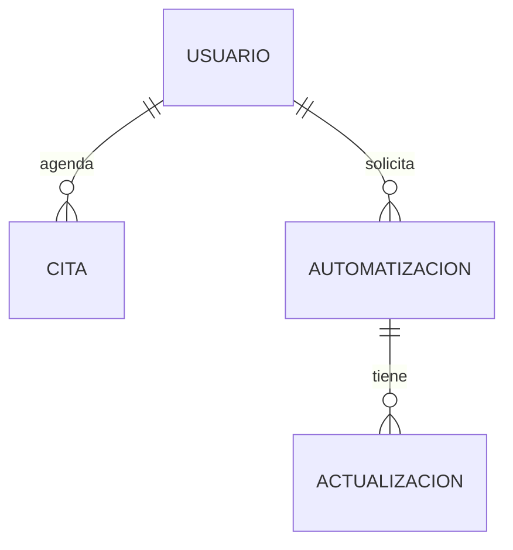
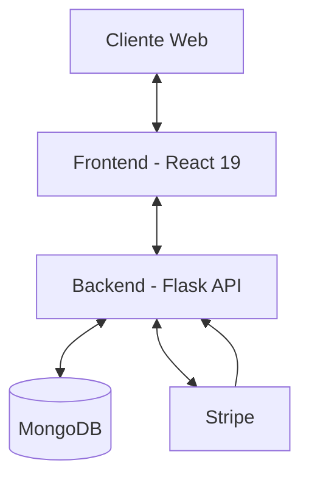

# 📘 Memoria Técnica: AutoFlow Solutions (TFG)

Este documento proporciona una visión detallada y exhaustiva del proyecto, cubriendo desde la arquitectura técnica hasta los casos de uso y el modelo de datos.

---

## 1. 🎯 Resumen del Proyecto

**AutoFlow Solutions** es una plataforma web orientada a empresas que desean automatizar sus procesos de negocio. El sistema simula el flujo real de una consultora de automatización: un cliente puede registrarse, solicitar una consultoría inicial, y una vez que el equipo valora su caso, se le asigna un proyecto de automatización que avanza por distintas fases hasta su entrega y valoración final.

El objetivo principal es digitalizar el ciclo completo de contratación de servicios de automatización: desde la cita de consultoría inicial hasta el pago fraccionado mediante Stripe, el seguimiento del desarrollo en tiempo real y la valoración del servicio.

---

## 2. 🛠️ Tecnologías Utilizadas

### Backend
- **Framework:** Flask (Python 3.11)
- **Autenticación:** PyJWT (doble token: access 15 min + refresh 7 días)
- **Base de Datos:** MongoDB 7 con PyMongo
- **Pagos:** Stripe (Checkout Sessions + Webhooks)
- **Arquitectura:** Blueprint Pattern para modularización de rutas

### Frontend
- **Framework:** React 19
- **Lenguaje:** TypeScript
- **Build Tool:** Vite
- **Estilos:** TailwindCSS v4
- **Animaciones:** Remotion + @remotion/player (animación hero N8N)
- **Gestión de Estado:** React Context API (AuthContext + ThemeContext)

### DevOps e Infraestructura
- **Contenedores:** Docker & Docker Compose
- **Base de Datos:** MongoDB (puerto 27018 en host)

---

## 3. 👥 Roles de Usuario y Casos de Uso

El sistema define dos roles principales:

### 🙋 Cliente
El usuario final que contrata los servicios de automatización.

- **CU-01:** Registrarse en la plataforma aceptando los términos de uso.
- **CU-02:** Iniciar sesión y cerrar sesión de forma segura.
- **CU-03:** Solicitar una cita de consultoría indicando tipo de automatización, descripción, fecha y franja horaria.
- **CU-04:** Solicitar un proyecto de automatización desde el dashboard.
- **CU-05:** Pagar el anticipo (50%) cuando el admin acepta el proyecto.
- **CU-06:** Consultar el progreso del desarrollo en tiempo real.
- **CU-07:** Pagar el importe final (50%) al completar el desarrollo.
- **CU-08:** Valorar el proyecto terminado (1-5 estrellas con comentario).
- **CU-09:** Cancelar un proyecto en fases previas a la finalización.
- **CU-10:** Chatear con el administrador en el contexto del proyecto.

### 🔑 Administrador
Usuario con acceso total al panel de gestión.

- **CU-11:** Visualizar todas las citas y automatizaciones del sistema.
- **CU-12:** Marcar citas como atendidas.
- **CU-13:** Aceptar solicitudes de automatización asignando presupuesto.
- **CU-14:** Rechazar solicitudes indicando el motivo.
- **CU-15:** Publicar hitos de desarrollo con porcentaje y descripción.
- **CU-16:** Marcar proyectos como terminados al finalizar el desarrollo.
- **CU-17:** Chatear con clientes en el contexto de cada proyecto.

---

## 4. 🗄️ Modelo de Datos

El sistema utiliza MongoDB con tres colecciones principales. Ver detalle completo en [DATABASE_SCHEMA.md](./DATABASE_SCHEMA.md).



### Colecciones principales
- **Usuarios:** Clientes y administradores con rol diferenciado en JWT (`cliente`, `admin`, `superadmin`).
- **Citas:** Solicitudes de consultoría con estado `pendiente` / `atendida`.
- **Automatizaciones:** Proyectos con ciclo de vida completo y pagos integrados.

---

## 5. 🔄 Ciclo de Vida de una Automatización

```
pendiente_revision
       │
  [admin acepta / rechaza]
       │
pendiente_pago_anticipo ──── rechazada
       │
  [cliente paga anticipo (Stripe)]
       │
  en_desarrollo
       │
  [admin publica avances y marca terminada]
       │
pendiente_pago_final
       │
  [cliente paga importe final (Stripe)]
       │
  terminada
       │
  [cliente valora]
```

El cliente puede **cancelar** en cualquier estado excepto `terminada` y `rechazada`.

---

## 6. 🏛️ Arquitectura del Sistema

Ver documento completo en [ARCHITECTURE.md](./ARCHITECTURE.md).

### Resumen

El proyecto sigue una arquitectura **cliente-servidor desacoplada**:

- **Backend:** API REST con Flask y Blueprints. Autenticación JWT con doble token. MongoDB como base de datos documental.
- **Frontend:** SPA React 19 con TypeScript. Context API para estado global. TailwindCSS v4 con patrón de estilos por componente.
- **Infraestructura:** Docker Compose orquesta tres servicios (frontend, backend, MongoDB).



---

## 7. 🔐 Seguridad

- **JWT dual:** Access token de corta duración + Refresh token de larga duración. Renovación silenciosa en el frontend.
- **Roles en token:** El payload del JWT incluye el rol del usuario. Las rutas del backend validan el rol mediante decoradores.
- **Stripe Webhooks:** Verificación de firma para garantizar la autenticidad de los eventos de pago.
- **CORS:** Configurado para aceptar únicamente peticiones desde el origen del frontend.
- **Asignación de rol admin:** Intencionalmente restringida a modificación directa en MongoDB, sin endpoint público.

---

## 8. 💳 Integración con Stripe

AutoFlow utiliza **Stripe Checkout Sessions** para gestionar los pagos de forma segura:

1. El backend crea una Checkout Session con el importe correspondiente (anticipo o pago final).
2. El frontend redirige al cliente a la URL de pago de Stripe.
3. Stripe notifica al backend vía **webhook** al confirmar el pago.
4. El backend actualiza el estado de la automatización automáticamente.

Para desarrollo local, es necesario usar **Stripe CLI** para recibir webhooks:
```bash
stripe listen --forward-to localhost:5000/api/stripe/webhook
```

---

## 9. 📁 Estructura del Proyecto

```text
TFG-MARIOVALIENTE/
├── backend/
│   ├── app.py                    # Entrada principal Flask
│   ├── db.py                     # Conexión a MongoDB
│   ├── requirements.txt
│   ├── Dockerfile
│   ├── blueprints/
│   │   ├── auth.py               # Registro, login, JWT
│   │   ├── citas.py              # Gestión de citas
│   │   ├── automatizaciones.py   # Ciclo de vida + Stripe
│   │   └── stripe_webhook.py     # Webhook de Stripe
│   └── middleware/
│       └── auth.py               # Decoradores require_auth / require_admin
├── frontend/
│   ├── src/
│   │   ├── App.tsx               # Rutas de la aplicación
│   │   ├── pages/                # Páginas por ruta
│   │   ├── components/           # Componentes reutilizables
│   │   ├── context/              # AuthContext, ThemeContext
│   │   ├── services/             # Llamadas a la API
│   │   └── types/                # Interfaces TypeScript
│   └── Dockerfile
├── docs/
│   ├── TFG_REPORT.md             # Este documento
│   ├── ARCHITECTURE.md           # Arquitectura técnica detallada
│   ├── DATABASE_SCHEMA.md        # Esquema de MongoDB
│   └── FEATURES.md               # Listado de funcionalidades
├── docker-compose.yml
└── LICENSE
```

---

## 10. 🚀 Estado del Despliegue

> [!IMPORTANT]
> **El proyecto está desplegado en producción en Railway.**
>
> | Servicio | Plataforma | URL |
> |---|---|---|
> | **Frontend** | Railway (Docker + Nginx) | https://frontend-production-30ae.up.railway.app |
> | **Backend** | Railway (Docker + Flask) | https://backend-production-c0780.up.railway.app/api |
> | **Base de Datos** | MongoDB Atlas (M0 free tier) | — |

---

## 11. 🧑‍🏫 Información Académica

| Campo | Valor |
|---|---|
| **Título** | AutoFlow Solutions — Plataforma de Gestión de Automatizaciones |
| **Tipo** | Trabajo de Fin de Grado (DAW) |
| **Autor** | Mario Valiente Giraldo |
| **Centro** | IES Hermenegildo Lanz |
| **Curso** | 2025 / 2026 |
